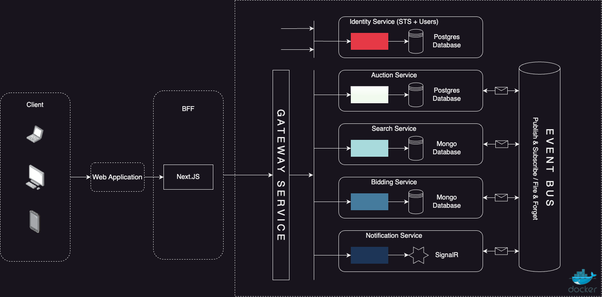

# Introduction

The SVC car auction application is a modern solution built using microservices architecture. It effectively enables the development of large, complex applications by breaking them down into smaller, more manageable pieces. This documentation provides a detailed overview of the application's architecture, technologies used, and key features.

## Technologies Used

- **Frontend:** 
  - React, TypeScript, Next.js, Tailwind CSS

- **Backend:**
  - C#, .NET, SignalR, MassTransit, PostgreSQL, MongoDB

- **Authentication and Authorization:**
  - IdentityServer, NextAuth.js

## Microservices - The Big Picture

Microservices architecture offers a comprehensive approach to developing large, complex applications. Here's an in-depth look at various aspects of microservices employed in the car auction application.

- **Decomposition of Applications:** Microservices effectively break down large applications into smaller, manageable pieces. Each microservice is responsible for a specific task and can be developed independently. In the context of my auction application, services like Auctions, Search, and Bids are implemented as individual microservices, allowing for better organization and maintainability. Each microservice has its own database, enabling data isolation and independence. This decomposition approach simplifies development and maintenance, making it easier to scale and evolve the application over time. It also makes the application more resilient to failures, as a failure in one microservice does not necessarily affect the entire system.

- **Scalability and Loose Coupling:** Microservices are designed to be scalable and loosely coupled, allowing them to evolve and scale independently. This architecture promotes flexibility and agility in development. By having each microservice handle a specific functionality, changes and updates can be made to individual services without affecting the entire system. Additionally, as I mentioned before, the use of separate databases for each microservice further enhances scalability and isolation.

- **Technology Diversity:** Microservices allow the use of different programming languages and technologies for individual services. This flexibility enables us to choose the best tools for each specific task. This diversity allows teams to leverage the strengths of different technologies and frameworks, leading to more efficient development and improved overall system performance. In the context of my SVC car auction application, I used MongoDb and PostgreSQL for data storage depending on each service's requirements. This is usually not possible in a monolithic architecture where the entire application is built using a single technology stack.

- **Service Bus:** Utilizing a service bus architecture allows for asynchronous messaging, enabling services to communicate without being directly dependent on each other. This approach ensures resilience in the face of service failures. In the SVC car auction application, a service bus is implemented to facilitate communication between microservices. This asynchronous communication pattern allows services to continue functioning even if one or more services fail, enhancing the overall reliability of the system.

- **Backend for Frontend (BFF) with Next.js and Tailwind:** The BFF pattern is implemented using Next.js and Tailwind CSS to provide dedicated backend services for frontend clients. This architecture enhances frontend performance and scalability by optimizing data fetching and rendering. Next.js enables functionality such as server-side rendering and generating static websites for React-based web applications, while Tailwind CSS provides a utility-first CSS framework for quickly building custom designs. Additionally, Zustand is employed for state management, offering a lightweight solution with a React hook API and minimal footprint.

- **Authentication with NextAuth.js:** NextAuth.js simplifies authentication in Next.js applications, providing components and utilities for seamless authentication integration. This library streamlines the implementation of authentication features such as login, registration, and session management, allowing developers to focus on building core application functionality.

- **Identity Provider and Single Sign-On (SSO):** OAuth2.0 is utilized for implementing single sign-on (SSO), enhancing user experience and security across multiple applications. Single sign-on allows users to authenticate once and access multiple applications without having to log in again. This simplifies the user experience and improves security by reducing the number of credentials that users need to manage.

- **Containerization with Docker:** Docker plays a pivotal role in the SVC car auction application by containerizing its microservices. This approach allows each microservice to be encapsulated within lightweight and portable containers. Docker ensures consistency and reliability across various environments, facilitating seamless deployment and scalability. Additionally, Docker's containerization provides isolation for each microservice, preventing dependencies or conflicts with other services. This isolation enhances security and stability, making Docker an ideal choice for deploying microservices-based applications. The Next.js application is not containerized at the moment.

- **Asynchronous Messaging Enhancement:** The SVC car auction application previously utilized synchronous messaging, which presented several challenges, including increased coupling between services and reduced fault tolerance. However, to address these issues and improve system resilience, the application has transitioned to asynchronous messaging. This communication pattern facilitates fire-and-forget message passing, significantly reducing coupling between services and enhancing fault tolerance. By employing a service bus for asynchronous messaging between microservices, the car auction application ensures reliable communication, even in the event of service failures. This shift to asynchronous messaging not only mitigates the drawbacks encountered with synchronous messaging but also enhances the overall robustness and scalability of the application.

- **Real-Time Communication with SignalR:** SignalR is employed for real-time bid updates, notifications, and live auction updates. It simplifies the addition of real-time web functionality to applications, enhancing user engagement and experience. SignalR enables features such as real-time messaging, broadcasting, and connection management, making it ideal for building interactive and responsive web applications. In the car auction application, SignalR is used to provide real-time updates to users during auctions, ensuring a seamless and engaging user experience.

- **Authentication and Authorization Protocols:** OpenID Connect and OAuth 2.0 are used for authentication and authorization in the application. These protocols enable secure access to protected resources and verify the identity of end-users. OpenID Connect is an identity layer built on top of OAuth 2.0, allowing clients to verify the identity of the end-user based on the authentication performed by an authorization server. OAuth 2.0 is used to check if the user is authorized to access a resource by issuing tokens to the client after successfully authenticating the user.

- **IdentityServer for User Management:** IdentityServer is utilized for managing user logins and permissions in the application. Razor Pages are leveraged only for the IdentityServer UI, providing out-of-the-box solutions for user registration and login. IdentityServer enables features such as user authentication, authorization, and token issuance, making it easier to manage user identities and access control in distributed systems.

- **Gateway Service and Reverse Proxy Implementation:**
  - **Gateway Service:** The SVC car auction application employs a gateway service to serve as the central entry point for all client requests within the microservices architecture. This gateway service is responsible for routing incoming requests to the appropriate backend services, ensuring efficient and secure communication between clients and the backend infrastructure.
    - **Unified Entry Point:** By providing a unified entry point, the gateway service abstracts away the complexity of internal service communication, offering clients a single interface to interact with the application.
    - **Features and Capabilities:** The gateway service offers a range of features, including:
      - **Load Balancing:** Distributing incoming requests evenly across multiple instances of backend services to optimize performance and resource utilization.
      - **Caching:** Storing frequently accessed data at the gateway level to reduce latency and improve responsiveness.
    - **Microservices Integration:** In the car auction application, the gateway service efficiently routes requests to individual microservices, ensuring seamless interaction between clients and backend services while maintaining scalability and fault tolerance.
  - **Reverse Proxy with YARP (Yet Another Reverse Proxy):** YARP is utilized as a reverse proxy built on top of ASP.NET Core, enhancing communication between clients and backend services.
    - **Request Routing:** YARP facilitates routing of client requests to the appropriate backend services based on predefined rules and configurations.
    - **Load Balancing:** YARP supports load balancing to distribute incoming traffic across multiple instances of backend services, ensuring optimal resource utilization and scalability.
    - **Simplified Configuration:** YARP simplifies the implementation of reverse proxy functionality by providing a straightforward configuration interface, enabling developers to focus on building core application features without the complexities of low-level networking operations.
    - **Enhanced Security and Performance:** By acting as a mediator between clients and backend services, YARP enhances security by implementing security policies and access controls, while also improving performance through optimized request handling and response caching.

- **MassTransit for Asynchronous Messaging:** MassTransit is utilized as a messaging framework to enable seamless communication between microservices in the SVC car auction application. MassTransit facilitates asynchronous messaging, which improves system resilience by reducing coupling between services and enhancing fault tolerance. Message consumers are implemented to process incoming messages, ensuring efficient handling of various events within the system. Additionally, MassTransit integrates with RabbitMQ as the message broker to provide reliable message delivery and routing. This integration enables features such as message queuing, routing, and delivery acknowledgment, ensuring reliable communication between microservices.

## Starting the Application

To start the the application, follow these steps:

1. Use `docker compose build` to build the Docker images.
2. Start the services using `docker compose up -d`.
3. Additionally, build Docker images for each service individually, e.g., `docker compose build gateway-svc`.
4. Note: If Airplay Receiver is running on port 5000, adjust port settings for Identity-svc to prevent conflicts.
5. To start the Next.js frontend, navigate to the `client-app` directory and install dependencies using `npm install`, and then run `npm run dev`.
